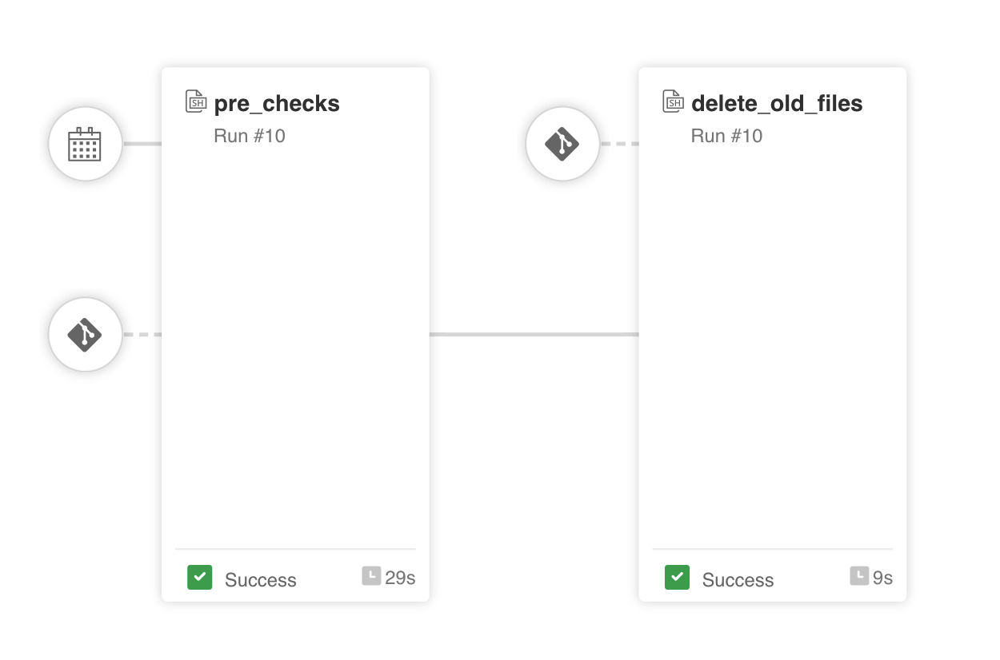
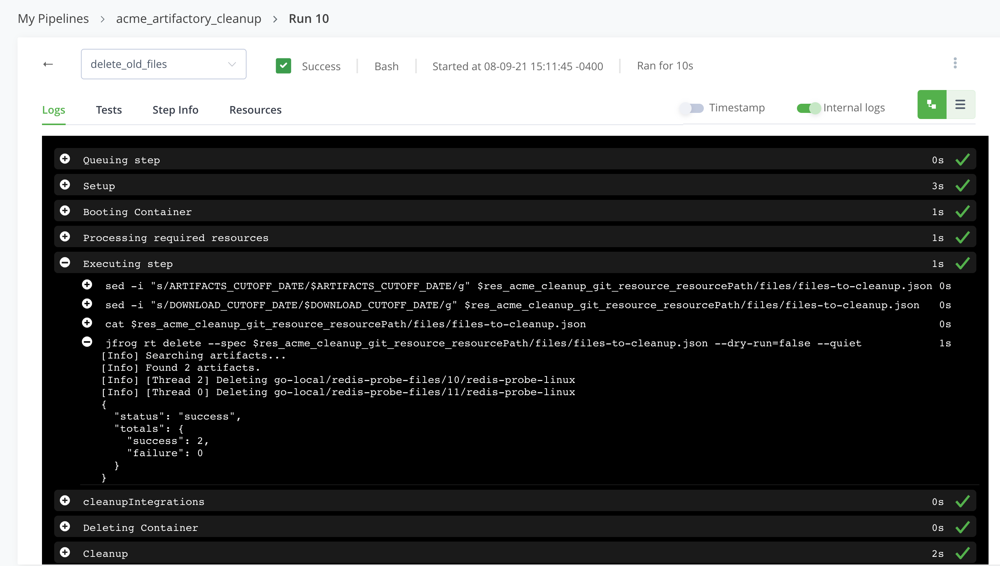

# JFrog Pipelines - Artifacts Cleanup sample

This is a sample of a JFrog Pipeline that cleans up old artifacts from JFrog Artifactory based on an AQL query's results.

**Note: This is a sample pipeline that I created as a learning exercise. The code available here is not supported or guaranteed to work. Use at your own discretion and risk. ***

This pipeline provides an example of how to use an AQL ([Artifactory Query Language](https://www.jfrog.com/confluence/display/JFROG/Artifactory+Query+Language)) to search for artifacts that are older than a configurable amount of days and that have not been downloaded for a configurable amount of time, and to delete the artifacts returned in the search results. 

This is an additional alternative to the existing mechanisms to manage old artifacts stored in JFrog Artifactory:

  - https://jfrog.com/knowledge-base/artifactory-cleanup-best-practices/ 
  - https://jfrog.com/blog/advanced-cleanup-using-artifactory-query-language-aql
  - https://github.com/jfrog/jfrog-cli-plugins/tree/main/rt-cleanup
  - https://github.com/jfrog/artifactory-user-plugins/tree/master/cleanup/cleanDockerImages

---

### Summarized setup instructions

1. Fork this project

2. Add [integrations](https://www.jfrog.com/confluence/display/JFROG/Pipelines+Step-By-Step#PipelinesStep-By-Step-AddIntegrations) for both your artifactory server and your git account to connect to the repository created in the step (1)

3. Upddate `values.yml` with your own values, see inline comments in the file for guidance
   It is recommended that you keep the `dryrun` option enabled until you feel comfortable and confident after running the pipeline a few times and making sure that the artifacts to be deleted listed in the pipeline's output are the ones you are targeting for deletion.

4. Customize `files/files-to-cleanup.json` to match your desired artifacts search query. 
  The sample provided will find artifacts that have been created since a certain date AND have not been downloaded since another date.   
  Also, the AQL provided includes a safety property `deleteme`=`true` in the artifacts search for initial tests. Feel free to delete it and/or add your own properties to the AQL file. 

5. Customize the `interval` parameter of the [cron trigger](https://www.jfrog.com/confluence/display/JFROG/CronTrigger) resource in `pipelines.yml` to set the specific time of the day/month that you want the pipeline to be triggered automatically.
  
6. Add your git repo from (1) as a [pipeline source](https://www.jfrog.com/confluence/display/JFROG/Pipelines+Step-By-Step#PipelinesStep-By-Step-add-pipeline-sourceAddaPipelineSource) to your JFrog Platform.

7. Once the new pipeline source is successfully resolved, go to "Pipelines > My Pipelines" in Artifactory and click on your pipeline's name, which is ready to be executed.

---

### Inspecting and debugging the pipeline results

Inspect the "Execution" logs of each step of the pipeline to familiarize yourself with the actions performed by the pipeline (e.g. what is the list of files returned for deletion) before disabling the `dryrun` mode in `values.yml`.

---

### Other ideas to extend and customize this pipeline

- Add an [approval gate](https://www.jfrog.com/confluence/display/JFROG/Approval+Gates) to the `delete_old_files` step, so you can review and then approve/reject the execution of the actual deletion procedure until you trust the behavior of this pipeline.

- Add a [notification](https://www.jfrog.com/confluence/display/JFROG/Pipelines+Utility+Functions#PipelinesUtilityFunctions-Notifications) capability to the pipeline to inform administrators about the files deleted or about to be deleted by the pipeline.

---
